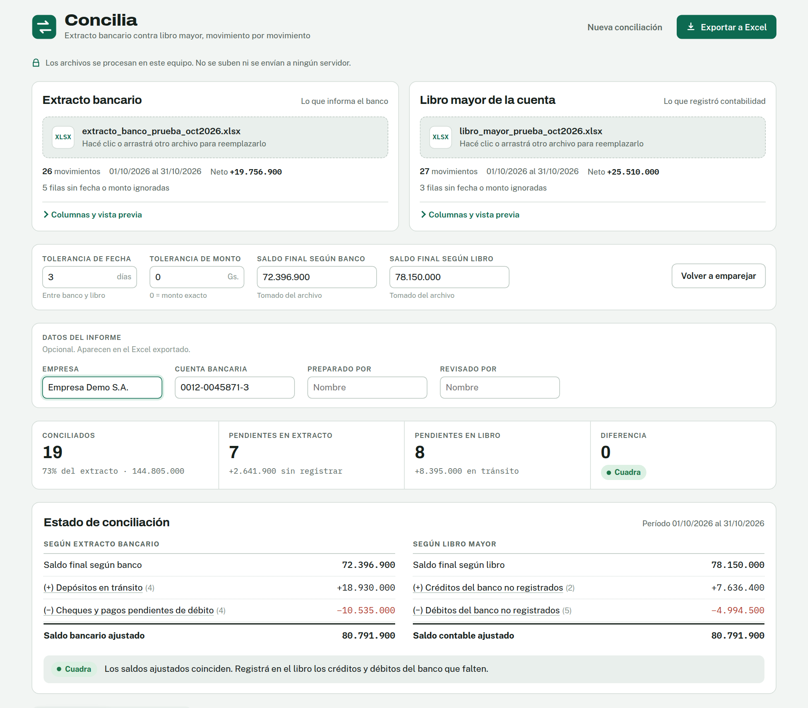
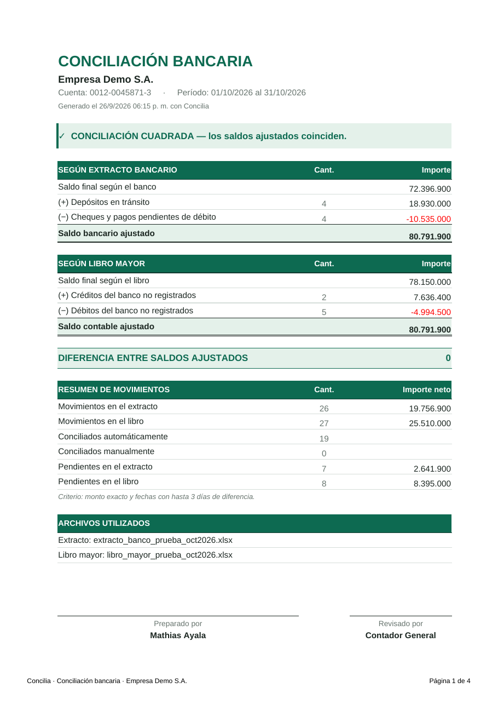

<div align="center">


# Concilia

**Conciliación bancaria gratuita para Windows.**
Compara el extracto del banco con el libro mayor, empareja los movimientos y arma el estado de conciliación y un informe en Excel listo para firmar.

[**⬇ Descargar la última versión**](https://github.com/ayalamathias55-art/CONCILIA/releases/latest)

</div>



## Qué hace

- **Lee el extracto y el libro mayor** en Excel (`.xlsx`, `.xls`), CSV o PDF con texto. Detecta solo las columnas de fecha, descripción, referencia, débito, crédito, importe y saldo, aunque cada banco o sistema las llame distinto.
- **Empareja los movimientos** por monto y fecha, con una tolerancia de días configurable. Cuando hay varios candidatos, prefiere la fecha más cercana, el mismo número de cheque o transferencia y la descripción más parecida.
- **Revisión manual:** en la pestaña Pendientes marcás uno o varios movimientos de cada lado y los conciliás juntos. Sirve, por ejemplo, para un depósito que agrupa varios cobros.
- **Estado de conciliación:** depósitos en tránsito, cheques pendientes, créditos y débitos del banco no registrados, saldos ajustados y diferencia.
- **Informe en Excel** con resumen y líneas de firma, hojas de pendientes y conciliados con formato, filtros y totales. Queda listo para imprimir en A4.



## Cómo usarlo

1. Descargá `Concilia_portable_vX.zip` desde [Releases](https://github.com/ayalamathias55-art/CONCILIA/releases/latest) y descomprimilo donde quieras: el Escritorio, un pendrive o una carpeta de red.
2. Abrí `Concilia.exe`. No necesita instalación ni conexión a internet.
3. Cargá el **extracto bancario** a la izquierda y el **libro mayor** de la cuenta a la derecha.
4. Revisá los pendientes, conciliá a mano los casos especiales y tocá **Exportar a Excel**.

En la carpeta `Ejemplos` del zip hay dos archivos para probarlo.

> **Primera vez:** Windows puede mostrar *"Windows protegió su PC"* porque el programa no tiene firma digital. Hacé clic en **Más información** y luego en **Ejecutar de todas formas**.

### Requisitos

- Windows 10 u 11 de 64 bits.
- [Microsoft Edge WebView2 Runtime](https://go.microsoft.com/fwlink/p/?LinkId=2124703). Ya viene incluido en Windows 10 y 11 actualizados. Si falta, Concilia te avisa.

## Formatos que reconoce

| Situación | Soporte |
|---|---|
| Débito y crédito en columnas separadas (o Debe / Haber) | ✓ |
| Una sola columna de importe con signo, o con columna D/C | ✓ |
| Importe sin signo: el signo se deduce de la columna Saldo | ✓ |
| Filas de título arriba, totales abajo, orden del más nuevo al más viejo | ✓ |
| Encabezados en dos filas (por ejemplo, "Importe" arriba y "Débito / Crédito" abajo) | ✓ |
| Fechas `dd/mm/aaaa`, `aaaa-mm-dd`, `15-oct-2026` y `mm/dd/aaaa` (se detecta sola) | ✓ |
| Montos `1.250.000`, `1.250,50`, `Gs. 1.250.000`, negativos entre paréntesis | ✓ |
| Columnas en español, inglés o portugués | ✓ |
| Libros con varias hojas (toma la que tiene los datos) | ✓ |
| CSV con `;` `,` o tabulador, en UTF-8 o codificación de Windows | ✓ |
| PDF escaneado (imagen) | ✗ Pedí el extracto en Excel |

Si alguna columna no se detecta bien, se corrige una vez en **Columnas y vista previa**. Concilia recuerda esa configuración para los próximos archivos con el mismo formato.

## Capacidad

Probado con hasta **100.000 movimientos por lado**. Con 50.000, la carga y el emparejamiento tardan unos 3 segundos y el informe en Excel unos 5.

## Privacidad

Los archivos se procesan en tu computadora. Concilia no envía datos a internet ni tiene servidores. Solo guarda tus preferencias (tolerancias, datos del informe y configuraciones de columnas) en `%LOCALAPPDATA%\Concilia`.

## Compilar desde el código

El programa es una interfaz web (`src/concilia.html`) dentro de una ventana nativa escrita en Go con WebView2.

```bash
python3 scripts/build_web.py              # genera web/index.html (versión offline)
go install github.com/tc-hib/go-winres@v0.3.3
go-winres make --arch amd64               # ícono y datos del .exe
GOOS=windows GOARCH=amd64 CGO_ENABLED=0 go build -trimpath -ldflags "-H windowsgui -s -w" -o Concilia.exe .
```

Se puede compilar desde Windows, Linux o macOS. Cada vez que se publica un **Release** en GitHub, la acción `.github/workflows/release.yml` compila el `.exe` y adjunta el zip portable automáticamente.

```
src/concilia.html     interfaz y lógica de conciliación
scripts/build_web.py  arma la versión offline en web/
web/                  interfaz empaquetada, librerías y tipografías
main.go               ventana de Windows, guardado de archivos
winres/               ícono y datos de versión del .exe
packaging/            LEEME.txt que va dentro del zip
ejemplos/             archivos de prueba
```

## Licencia

Concilia es **gratuito**. Podés usarlo en tu empresa o en las de tus clientes, modificarlo y compartirlo, pero **no venderlo** ni cobrar por un producto o servicio basado en él. Se distribuye bajo licencia MIT con la condición [Commons Clause](https://commonsclause.com/). El texto completo está en [LICENSE](LICENSE).

Los componentes de terceros que incluye están listados en [THIRD_PARTY_NOTICES.md](THIRD_PARTY_NOTICES.md).

---

Hecho en Paraguay por Mathias Ayala.
